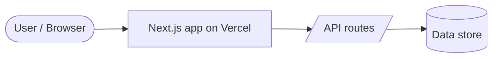
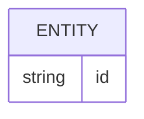

# Architecture Overview: {{Product name}}

## System context

## Components
| Component | Responsibility | Tech |
|-----------|----------------|------|

## Data model

## Key flows
1. …

## Cross-cutting concerns
- **Security:** …
- **Observability:** `/api/health` endpoint, Vercel logs
- **Testing:** unit tests (Vitest) in CI
